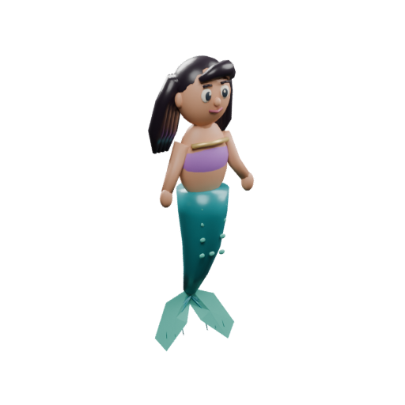

# Mermaidia original art direction and production record

Mermaidia uses original dimensional illustrations: soft silhouettes, readable eyes and appendages, restrained saturated color, and tactile PBR surfaces. Elise is an original fictional mermaid. Wildlife is an artistic reconstruction informed by inspected references, not a photographic reconstruction or scientific certification.

## Reproduction and conventions

The complete editable source is the deterministic Python recipe [build_assets.py](../scripts/blender/build_assets.py) plus [species.py](../scripts/blender/species.py). No downloaded mesh, documentary frame, photograph, font or texture is included in a model. Build metadata is [assets/source/build.json](../assets/source/build.json); the evidence gate and per-subject builder choices are [model-reference-index.json](../assets/source/model-reference-index.json).

```sh
BLENDER_BIN=/Applications/Blender.app/Contents/MacOS/blender
"$BLENDER_BIN" --background --factory-startup --python-exit-code 1 \
  --python scripts/blender/build_assets.py -- --seed 4107 --output public/assets --portraits --views
node scripts/blender/inspect_glb.mjs
```

Use the installed `blender` command on Linux or set `BLENDER_BIN` to the installed executable. Verified authoring version: Blender **5.2.1 LTS**, bundled glTF exporter, Cycles CPU portrait renderer. A Python exception causes a nonzero exit. The recipe uses a fixed seed of 4107. `--only ID` exports one asset; `--only feature` exports features without rebuilding wildlife. Omit `--portraits --views` for a fast geometry-only build. Production builds should include portraits after geometry changes.

* Blender: meters, Z up, +Y forward. Export: standard glTF meters, **Y up, -Z forward**, no runtime corrective rotation for Elise, fish, turtles or seals.
* The origin is approximately the body center for swimming animals. Upright birds have their feet near ground level; plants, rock and wreck kits have their base at ground level. Penguin swimming posture is a runtime orientation, distinct from standing on ice.
* Material names describe authored surfaces. Hex palette colors are converted from sRGB to linear before writing PBR base color. Roughness and metallic values are standard glTF values. No Blender-only procedural shader is assumed to survive export.
* Meshes have normals and UVs; pigmentation is modeled with material regions. Related fixed parts merge into a mesh with a small palette. Articulated appendages remain separate to permit local cyclic motion. All GLB cameras/lights are excluded. No external texture or decoder download is needed.
* Paths: `public/assets/models/{id}.glb`; transparent RGBA `public/assets/portraits/{id}.png`. Provenance and SHA-256 are in [models.json](../assets/manifests/models.json). Asset IDs equal discovery IDs, with `-portrait` appended for portraits.
* `Elise` animation clips: `idle`, `swim`, `fast`, `turn`, `look`, `surface`. Cycles use different durations and tail amplitudes; head motion increases for looking and turning. Hair motion stays gentle. The controller chooses the applicable clip. Wildlife exposes one appropriate cyclic clip, such as `swim`, `glide`, `sway`, or `pulse`; runtime paths handle schooling, habitat constraints and surface visits.

## Elise

Elise has dark espresso hair, warm skin, large curious eyes, a small friendly smile, a comfortable lavender swim top with a narrow gold trim, and a teal tail with pale turquoise flukes. This is an original construction without a franchise reference. Long swept hair frames the face and falls behind the shoulders. Pale scale accents and a divided membrane tail establish a readable silhouette in a following camera. Her proportions are deliberately illustrative. She is about 2.5 model meters from hair to fluke; runtime scale should remain consistent across destinations.



## Evidence and visual review

The content worker and art worker opened the actual reference images before adding a subject to the build index. Evidence identifiers resolve to the source registry in [content/catalog.ts](../content/catalog.ts). Reference-only originals are held under ignored `artifacts/references`; their presence there does not grant redistribution rights. The source registry and [habitat research](HABITAT_RESEARCH.md) hold the original links and local occurrence evidence. The Blender-authored 3D models and their rendered portraits are original project artwork released under CC0-1.0. The separate decorative 2D menu background is original built-in image-generation output with its own [prompt and provenance record](MENU_ART.md); it is not a Blender render or ecological evidence.

Inspected reference groups include the NPS Buck Island front brochure (2011), the AAP species photographs, NOAA green turtle, Florida Museum sergeant major, DBCA giant clam and anemonefish, NOAA Florida Keys yellowtail snapper and green moray, MBARI research photographs, and the Green Island rail photograph. The 2017 Benwood orthomosaic and two current NOAA bow photographs informed a low broken hull, raised damaged bow and triangular steel knees. It has no intact pirate-ship silhouette, sails, treasure chest or interior maze.

The first rendered contact sheet revealed correctable problems: desaturated palette values, membrane normals causing black facets, skin markings protruding as spheres, and sharp elkhorn blades. Corrections converted sRGB colors, gave membrane meshes proper normal-oriented volume, moved fish bars and seal mottling into surface pigmentation, and rounded/flattened elkhorn branches. Fish body proportions and tail shape distinguish the deep-bodied tang and sergeant major, small round-tailed anemonefish, and streamlined yellowtail snapper. Hawksbill has a tapered hooked beak and amber carapace mottling; green turtle has a smoother olive shell. Penguin ear patches and white eye rings are species-specific. Snow petrel has a black bill. The female elephant seal has no large adult male trunk.

Deep animals retain separate silhouettes: paired lobes and eight comb rows; a clear barreleye dome with internal upward green eyes; eight webbed vampire-squid arms, paired fins and two feeding filaments; a broad bell with six thick oral arms; a red larvacean trunk, muscular tail and sparse mucus-house strands. Comb-row highlights represent reflected observation light, never a claim of emitted rainbow light. Observation lighting and content-documented enlargements make the small subjects readable. Mucus-house strands are thickened for visibility and do not imply an opaque spherical shell.

### Saved review artifacts

* [Three-quarter contact sheet](../artifacts/art/contact-sheet.png), generated from the actual Blender renders.
* Per-subject front and side PNGs: `artifacts/art/{id}-front.png` and `{id}-side.png`.
* [Khronos validation](../artifacts/art/glb-validation.json) records each GLB's errors, warnings, clips, primitive count and bytes.
* Build logs: `artifacts/art/build-final.log` and subsequent final export log.
* Actual browser habitat lighting, camera and interaction review belongs to the coordinated visual QA captures and [QA report](QA_REPORT.md). Blender portraits alone do not validate Three.js appearance.

This review checks recognizable identifying anatomy and artistic consistency. Fine skeletal detail, exact field coloration, accurate current population abundance and survey-accurate topography are beyond these compact original reconstructions. Those limits remain visible in grown-up research notes rather than being represented as biological facts.

## Final asset gate — September 10, 2026

All **41 GLBs** and **41 transparent RGBA portraits** are present. This includes 39 discovery subjects, Elise, and the generic reef limestone kit. [The final Khronos report](../artifacts/art/glb-validation.json) has **zero errors and zero warnings**. The integrated registry audit reports **185 total game assets, zero errors** in [asset-validation.json](../artifacts/asset-validation.json). Every production portrait was checked for RGBA output and a transparent corner pixel; none retained the earlier opaque backdrop.

The measured lossless optimization pass reduced GLBs from **5,450,616 to 5,428,376 bytes** (22,240 bytes, about 0.4%). This modest result is retained honestly; palette merging in Blender already performs most of the reduction. [Per-file measurements](../artifacts/art/optimization.json) show where deduplication, welding and pruning helped. No decoder/transcoder is required. Run `node scripts/blender/optimize.mjs` after Blender export; it updates checksums and refuses a larger serialized result. It preserves UVs and animation clips. The low polygon meshes serve all quality modes; separate lossy LODs are not useful at these current foreground mesh sizes. Runtime density, instancing and draw-call measurements remain part of integrated performance QA.

All front, three-quarter and side sheets were opened for visual comparison, including the corrected results. Further concrete corrections from this review were a continuously transported tube frame to remove a pinched moray waist, continuous blue stripes on the grunt, a visible dark pupil within the Adélie white eye ring, visible seal eyes, bird toes, a barred rail underside, curved turtle flipper outlines, and a more elongated leopard-seal body and head. [Final sheets](../artifacts/art/sheets/) retain the source IDs beside each subject. Review montages are `artifacts/art/review-group-1.png` through `review-group-9.png`.

**Identity/anatomy review: 1/2 — recognizable but rough**, under the brief's rubric. This is an honest asset-level assessment rather than a claim of polished photographic anatomy. Identifying body plans, appendage counts and major markings are present, but seal mottling, seabird plumage, fin surfaces, mucus-house strands and marine substrate forms are deliberately simplified. **Elise design readability: 2/2** in the opened front/side/three-quarter renders. Habitat composition, movement, transitions and child usability require the separate integrated browser review and cannot be scored from these portraits.

### Per-subject visual evidence and contact sheets

| Subject | Inspected visual sources | Three-view sheet |
| --- | --- | --- |
| green-turtle | [green-turtle-noaa](https://www.fisheries.noaa.gov/species/green-turtle) | [Review](../artifacts/art/sheets/green-turtle.png) |
| giant-clam | [clam-dbca](https://www.dbca.wa.gov.au/wildlife-and-ecosystems/marine/marine-parks/fun-facts/giant-clam), [natgeo-clam](https://www.nationalgeographic.com/animals/invertebrates/facts/giant-clam) | [Review](../artifacts/art/sheets/giant-clam.png) |
| hawksbill-turtle | [buck-animals](https://www.nps.gov/buis/learn/nature/animals.htm), [buck-front](https://www.nps.gov/buis/planyourvisit/upload/Buck-Island-Front.pdf) | [Review](../artifacts/art/sheets/hawksbill-turtle.png) |
| blue-tang | [buck-front](https://www.nps.gov/buis/planyourvisit/upload/Buck-Island-Front.pdf) | [Review](../artifacts/art/sheets/blue-tang.png) |
| elkhorn-coral | [buck-front](https://www.nps.gov/buis/planyourvisit/upload/Buck-Island-Front.pdf) | [Review](../artifacts/art/sheets/elkhorn-coral.png) |
| sea-fan | [keys-creatures](https://floridakeys.noaa.gov/education/creature-feature.html), [buck-front](https://www.nps.gov/buis/planyourvisit/upload/Buck-Island-Front.pdf) | [Review](../artifacts/art/sheets/sea-fan.png) |
| spiny-lobster | [buck-front](https://www.nps.gov/buis/planyourvisit/upload/Buck-Island-Front.pdf), [keys-creatures](https://floridakeys.noaa.gov/education/creature-feature.html) | [Review](../artifacts/art/sheets/spiny-lobster.png) |
| brown-pelican | [buck-front](https://www.nps.gov/buis/planyourvisit/upload/Buck-Island-Front.pdf), [buck-animals](https://www.nps.gov/buis/learn/nature/animals.htm) | [Review](../artifacts/art/sheets/brown-pelican.png) |
| adelie-penguin | [adelie-aap](https://www.antarctica.gov.au/about-antarctica/animals/penguins/adelie-penguin/) | [Review](../artifacts/art/sheets/adelie-penguin.png) |
| emperor-penguin | [emperor-aap](https://www.antarctica.gov.au/about-antarctica/animals/penguins/emperor-penguin/) | [Review](../artifacts/art/sheets/emperor-penguin.png) |
| weddell-seal | [weddell-aap](https://www.antarctica.gov.au/about-antarctica/animals/seals/weddell-seal/) | [Review](../artifacts/art/sheets/weddell-seal.png) |
| southern-elephant-seal | [elephant-aap](https://www.antarctica.gov.au/about-antarctica/animals/seals/elephant-seal/) | [Review](../artifacts/art/sheets/southern-elephant-seal.png) |
| leopard-seal | [leopard-aap](https://www.antarctica.gov.au/about-antarctica/animals/seals/leopard-seal/) | [Review](../artifacts/art/sheets/leopard-seal.png) |
| snow-petrel | [snow-petrel-aap](https://www.antarctica.gov.au/about-antarctica/animals/flying-birds/petrels-and-shearwaters/snow-petrel/) | [Review](../artifacts/art/sheets/snow-petrel.png) |
| bloody-belly-comb-jelly | [mbari-bloody-belly-comb-jelly](https://www.mbari.org/animal/bloody-belly-comb-jelly/) | [Review](../artifacts/art/sheets/bloody-belly-comb-jelly.png) |
| barreleye | [mbari-barreleye-fish](https://www.mbari.org/animal/barreleye-fish/), [barreleye-aquarium](https://www.montereybayaquarium.org/animals-the-ocean/animals-a-to-z/barreleye) | [Review](../artifacts/art/sheets/barreleye.png) |
| vampire-squid | [mbari-vampire-squid](https://www.mbari.org/animal/vampire-squid/), [vampire-research](https://www.mbari.org/news/mbari-researchers-discover-what-vampire-squids-eat-its-not-what-you-think/) | [Review](../artifacts/art/sheets/vampire-squid.png) |
| big-red-jelly | [mbari-big-red-jelly](https://www.mbari.org/animal/big-red-jelly/) | [Review](../artifacts/art/sheets/big-red-jelly.png) |
| redhead-larvacean | [mbari-redhead-larvacean](https://www.mbari.org/animal/redhead-larvacean/) | [Review](../artifacts/art/sheets/redhead-larvacean.png) |
| yellowtail-snapper | [keys-creatures](https://floridakeys.noaa.gov/education/creature-feature.html) | [Review](../artifacts/art/sheets/yellowtail-snapper.png) |
| blue-striped-grunt | [grunt-museum](https://www.floridamuseum.ufl.edu/discover-fish/species-profiles/bluestriped-grunt/) | [Review](../artifacts/art/sheets/blue-striped-grunt.png) |
| sergeant-major | [sergeant-major-museum](https://www.floridamuseum.ufl.edu/discover-fish/species-profiles/sergeant-major/) | [Review](../artifacts/art/sheets/sergeant-major.png) |
| green-moray | [keys-creatures](https://floridakeys.noaa.gov/education/creature-feature.html) | [Review](../artifacts/art/sheets/green-moray.png) |
| anemonefish | [anemonefish-dbca](https://www.dbca.wa.gov.au/wildlife-and-ecosystems/marine/marine-parks/fun-facts/anemonefish) | [Review](../artifacts/art/sheets/anemonefish.png) |
| buff-banded-rail | [green-rail](https://visitgreenisland.com.au/green-island-eco-tour/) | [Review](../artifacts/art/sheets/buff-banded-rail.png) |
| turtle-grass | [turtle-grass-source](https://www.floridamuseum.ufl.edu/southflorida/habitats/seagrasses/species/) | [Review](../artifacts/art/sheets/turtle-grass.png) |
| antarctic-krill | [krill-aap](https://www.antarctica.gov.au/about-antarctica/animals/krill/) | [Review](../artifacts/art/sheets/antarctic-krill.png) |
| reef-sand | [buck-front](https://www.nps.gov/buis/planyourvisit/upload/Buck-Island-Front.pdf) | [Review](../artifacts/art/sheets/reef-sand.png) |
| reef-limestone | [buck-front](https://www.nps.gov/buis/planyourvisit/upload/Buck-Island-Front.pdf) | [Review](../artifacts/art/sheets/reef-limestone.png) |
| beach-sand | [buck-front](https://www.nps.gov/buis/planyourvisit/upload/Buck-Island-Front.pdf) | [Review](../artifacts/art/sheets/beach-sand.png) |
| wreck-bow | [benwood-noaa](https://floridakeys.noaa.gov/shipwrecktrail/benwood.html) | [Review](../artifacts/art/sheets/wreck-bow.png) |
| wreck-ribs | [benwood-noaa](https://floridakeys.noaa.gov/shipwrecktrail/benwood.html) | [Review](../artifacts/art/sheets/wreck-ribs.png) |
| wreck-sand | [benwood-noaa](https://floridakeys.noaa.gov/shipwrecktrail/benwood.html) | [Review](../artifacts/art/sheets/wreck-sand.png) |
| sea-ice | [casey-aap](https://www.antarctica.gov.au/antarctic-operations/stations-and-field-locations/casey/environment/) | [Review](../artifacts/art/sheets/sea-ice.png) |
| antarctic-rock | [casey-aap](https://www.antarctica.gov.au/antarctic-operations/stations-and-field-locations/casey/environment/) | [Review](../artifacts/art/sheets/antarctic-rock.png) |
| marine-snow | [mbari-redhead-larvacean](https://www.mbari.org/animal/redhead-larvacean/) | [Review](../artifacts/art/sheets/marine-snow.png) |
| deep-water | [mbari-bloody-belly-comb-jelly](https://www.mbari.org/animal/bloody-belly-comb-jelly/) | [Review](../artifacts/art/sheets/deep-water.png) |
| seagrass | [halodule-visual](https://ian.umces.edu/media-library/halodule-uninervis/), [halodule-photo](https://commons.wikimedia.org/wiki/File:Seagrass_Halodule_uninervis_(5777808662).jpg) | [Review](../artifacts/art/sheets/seagrass.png) |
| staghorn-coral | [acropora-museum](https://australian.museum/blog/amri-news/resilient-coral-rebuilds-on-lizard-island-reefs-/) | [Review](../artifacts/art/sheets/staghorn-coral.png) |

### Revision 2 follow-up: sea fan and Benwood steel

The independent review's regular sea-fan grid and tubular wreck findings prompted a scoped rebuild of `sea-fan`, `wreck-bow` and `wreck-ribs`. The original [NPS Buck Island reference](https://www.nps.gov/buis/planyourvisit/upload/Buck-Island-Front.pdf), [NOAA bow photograph](https://floridakeys.noaa.gov/media/img/20240126-benwood-bow-1000.jpg), and [NOAA 2017 orthomosaic](https://floridakeys.noaa.gov/media/img/20240124-benwood-bow-orthomosaic-model-1000.jpg) were reopened before modeling. No reference pixels are embedded in these original assets.

The fan now has a broad asymmetric outline, curved primary branches and fine irregular interconnected cells. The lower-detail triangular cross sections preserve the colony silhouette while keeping repeated instances affordable. The wreck geometry now uses thin plate knees, rectangular angle sections, irregular torn plate edges, actual perforations, buckled fragments and small calcareous deposits. Original spatial noise supplies rust/buff/olive vertex colors (`COLOR_0`), retained by glTF; no unsupported procedural shader or downloaded texture is required. Bow dimensions remain a compressed approximately 8 m exterior interpretation, not a survey-scale replica of the entire cargo ship.

All nine final front/side/three-quarter renders were opened: [fan](../artifacts/art/sheets/sea-fan.png), [bow](../artifacts/art/sheets/wreck-bow.png), [ribs](../artifacts/art/sheets/wreck-ribs.png). These show the addressed shape/material changes. They remain stylized: the wreck's encrusting communities and fine corrosion are simplified, and this asset inspection does not award the integrated destination visual gate a pass. Production portraits retain transparent RGBA backgrounds.

| Asset | GLB bytes | Triangles | Primitives |
| --- | ---: | ---: | ---: |
| sea-fan | 280,028 | 9,440 | 1 |
| wreck-bow | 1,948,608 | 29,396 | 1 |
| wreck-ribs | 486,948 | 7,632 | 1 |

Reproduce just this revision with `Blender --background --factory-startup --python-exit-code 1 --python scripts/blender/build_assets.py -- --only sea-fan,wreck-bow,wreck-ribs --portraits --views`, then `node scripts/blender/optimize.mjs sea-fan,wreck-bow,wreck-ribs`. The optimizer's optional ID filter preserves unrelated model files and merges the report. Asset-local seeded random generators make these three geometries independent of build subset/order. All 41 GLBs now total 5,428,376 bytes, with zero Khronos errors or warnings in [GLB validation](../artifacts/art/glb-validation.json). The [registry audit](../artifacts/asset-validation.json) verifies their updated hashes and evidence IDs. [Optimization report](../artifacts/art/optimization.json).


### Integrated material and visual review

The runtime adds original mineral color patches, fine porous variation and crust variation to rock/coral materials, plus gently relieved, textured Antarctic ice. These are Three.js material additions, separate from exported Blender PBR colors; no documentary pixels or downloaded textures are embedded. The initial shader regression and its correction are preserved in the [independent review](INDEPENDENT_REVIEW.md#revision-4--material-shader-regression-1843-utc), rather than erased from the evidence trail.

The latest actual destination-specific captures meet the internal 10/12 threshold: Australia, Caribbean and Antarctica in [revision 5](INDEPENDENT_REVIEW.md#revision-5--corrected-material-shader-1846-utc), and Benwood/deep midwater in [revision 3](INDEPENDENT_REVIEW.md#revision-3--surface-and-authored-environment-fixes). Those last two destinations were not recaptured in revision 5. This is a stylized readability assessment; simplified anatomy and movement remain 1/2 each. It does not establish photorealism, expert scientific certification or a completed child study.
